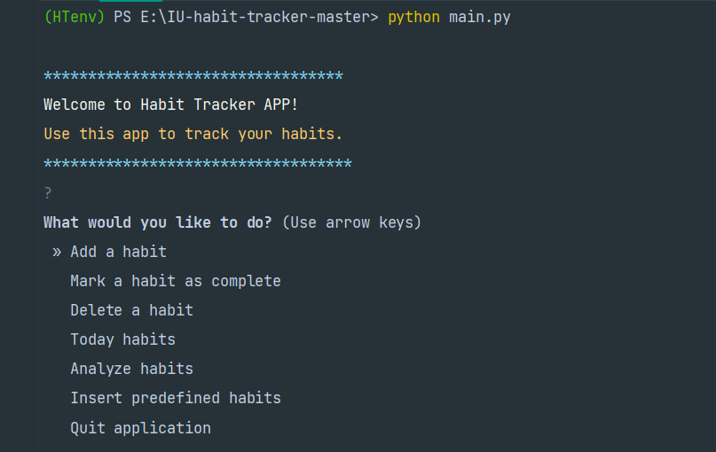
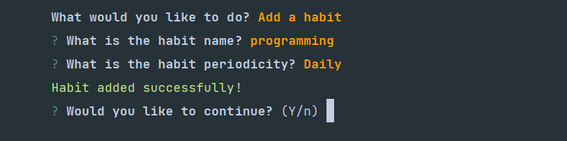

IU Habit Tracker - README
====================================================================================    
**This is the backend of a Habit tracker application using Python programming language for the module Object-Oriented and 
Functional Programming at the IU university of applied science.**

## Installation

#### This application requires Python version >= 3.7

### Install IU Habit Tracker

- Download the latest version of IU habit tracker from 
[here](https://github.com/mohamadsolouki/IU-habit-tracker/archive/refs/heads/main.zip) or clone the repository 
- unzip the file and go to the "IU-habit-tracker-main" directory
- Create a python virtual environment

``` sh
$ python -m venv env
```

- Activate your environment

``` sh
$ .\env\Scripts\activate
```

- Install the requirements

``` sh
$ pip install -r requirements.txt
```

### Run habit tracker

- Switch to parent folder "habitTrackerIU-main"
- Run the main.py

``` sh
$ python main.py
```

- You should see the main menu like this which asks you to use predefined data or use your own data:


### Run tests

- Switch to the "tests" folder
- Run pytest

``` sh
$ pytest .
```

You should see something like this if all the tests are successful:


---
## Usage

You can navigate through the options using the arrow keys and press enter to select an option.

### Main menu


 
### Add habit



### Mark habit as done


### Delete habits


### Habits to do


### Analytics


---

## Author

👤 **Mohammadsadegh Solouki**

* Github: [@mohamadsolouki](https://github.com/mohamadsolouki)
* LinkedIn: [@Mohamad Solouki](https://linkedin.com/in/mohamadsolouki)

## Show your support

Give a ⭐️ if this project helped you!