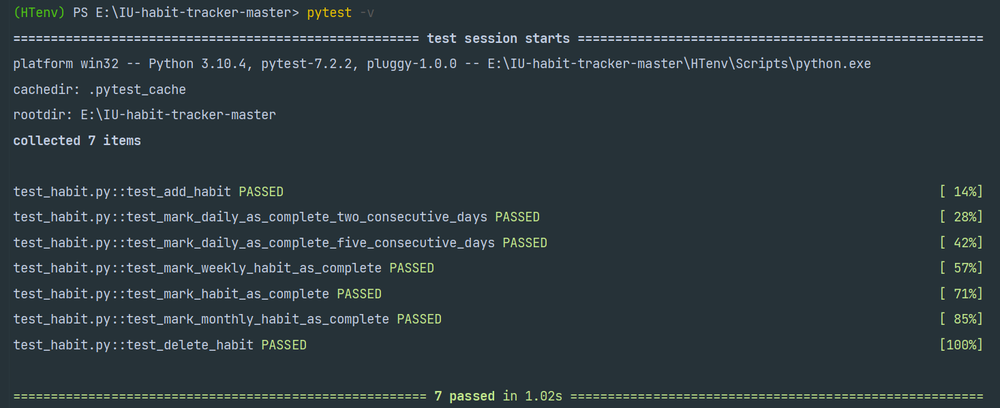
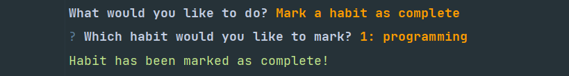
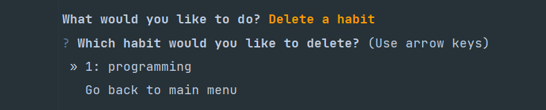
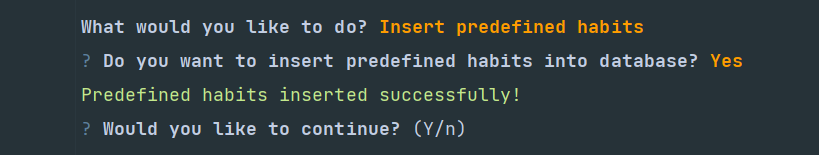
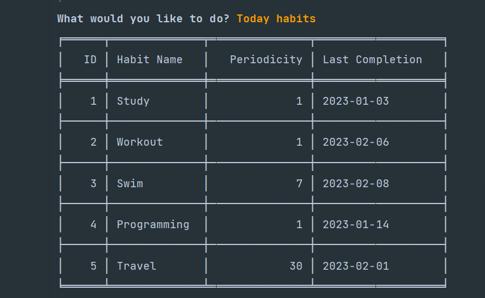
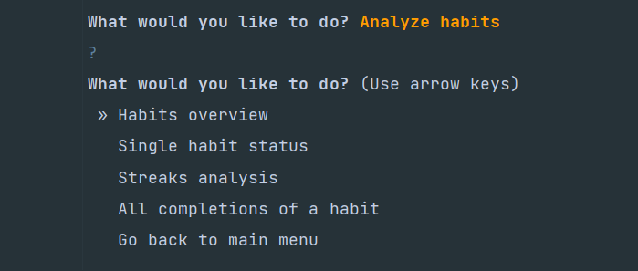

IU Habit Tracker - README
====================================================================================    
**This is the backend of a Habit tracker application using Python programming language for the module Object-Oriented and 
Functional Programming at the IU university of applied science.**

## Installation
**This application requires Python version >= 3.7**

*For the installation of Python, you can follow the instructions in the following [link](https://www.python.org/downloads/)*


### Install IU Habit Tracker

- Download the latest version of IU habit tracker from 
[here](https://github.com/mohamadsolouki/IU-habit-tracker/archive/refs/heads/main.zip) or clone the repository 
- unzip the file and go to the "IU-habit-tracker-master" directory
- Create a python virtual environment

``` sh
python -m venv HTenv
```

- Activate your environment

``` sh
.\HTenv\Scripts\activate
```

- Install the requirements

``` sh
pip install -r requirements.txt
```

## Run tests

- Switch to the "tests" folder
- Run pytest

``` sh
pytest .
```

You should see something like this if all the tests are successful:



---
## Usage

### Run habit tracker

- Switch to parent folder "IU-habit-tracker-master"
- Run the main.py

``` sh
python main.py
```

- You should see the main menu like this which asks you to use predefined data or use your own data:


You can navigate through the options using the arrow keys and press enter to select an option.
 
### Add habit
- You can add a habit by entering the name of the habit and the period of the habit.


### Mark habit as done
- You can mark a habit as done by selecting the name of the habit from the list.



### Delete habits
- You can delete habits by selecting the name of the habit from the list.



### Insert predefined data
- You can insert predefined data by selecting this option from the main menu.
- It will insert 5 predefined habits with different periods.
- You can see predefined data in JSON format in the "data" folder.



### Habits to do
- This option shows you the habits that you have to do today based on the period of the habit.



### Analytics
- This option uses analyze module to show users the details of their habits.
- "Habits overview" option will show an overview of the habits that user has entered based on their period.
- "Single habit status" will show you the list of all habits, and you can select one of them to see the details of that habit.
- "Streaks analysis" will show you a table of all habits and their current and longest streaks.
- "All completions of a habit" will show you a list of all habits, and you can select one of them to see all the dates that you have marked that habit as done.


---

## Author

👤 **Mohammadsadegh Solouki**

* Github: [@mohamadsolouki](https://github.com/mohamadsolouki)
* LinkedIn: [@Mohamad Solouki](https://linkedin.com/in/mohamadsolouki)

---
## Show your support

Give a ⭐️ if this project helped you! 

---
## Contributing
This project is for educational purposes only. Contributions, issues and feature requests are welcome!
